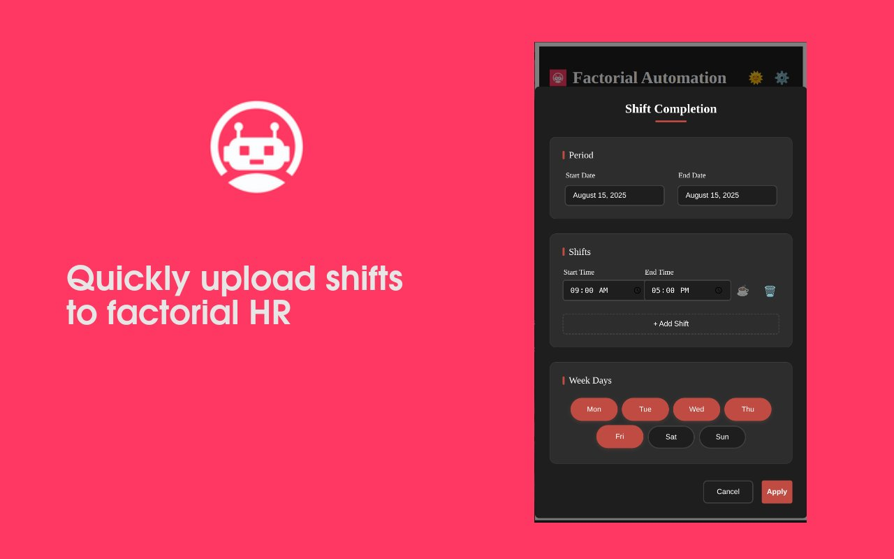

# Factorial Automation Chrome Extension (Made with AI SLOP)


A Chrome extension that automates shift submissions in Factorial HR. This extension allows you to:

- Submit multiple shifts at once
- Set recurring shifts for specific weekdays
- Define multiple time ranges per day
- Mark shifts as breaks
- Configure your timezone

Spiritually based on [fucktorial](https://github.com/txomin-jimenez/fucktorial).



## Build

1. Install dependencies:

```bash
npm install
```

1. Build the extension:

```bash
npm run build
```

1. Load the extension in Chrome:
    - Open Chrome and go to `chrome://extensions/`
    - Enable "Developer mode"
    - Click "Load unpacked"
    - Select the root directory of this project

## Development

- Run in watch mode:

```bash
npm run watch
```

## Project Structure

- `src/popup/`: Contains the React-based popup UI
- `dist/`: Contains the compiled extension files

## Configuration

### Getting Your Factorial Credentials

Before using the extension, you'll need to gather two pieces of information:

1. Your Employee ID
2. Your Factorial Session Cookies

To get these:

1. Log in to Factorial HR in Chrome
2. Open Chrome DevTools (F12 or Right Click -> Inspect)
3. Go to the Network tab
4. Filter for "graphql" requests
5. Perform any action in Factorial (or reload the page)
6. Find a GraphQL request and:
   - Look at the request payload to find your `employeeId`
   - In the request headers, find and copy the entire `cookie` value

### Extension Settings

Once you have your credentials:

1. Click the extension icon
2. Click the ⚙️ (settings) icon
3. Enter your Employee ID
4. Paste your cookies
5. (Optional) Adjust your UTC offset (default: +02:00)

> **⚠️ Security Note**: The extension stores your session cookies locally. For security:
>
> - Clear the cookies field after you're done using the extension
> - Never share your extension settings or cookies with anyone
> - Regularly update your Factorial session by logging out and back in

## Features

- **Bulk Shift Submission**: Create multiple shifts at once
- **Date Range Selection**: Choose start and end dates for shifts
- **Weekday Filtering**: Select which days of the week to create shifts for
- **Multiple Time Ranges**: Add multiple shifts per day
- **Break Management**: Mark shifts as breaks (e.g., lunch breaks)
- **UTC Offset**: Configure timezone for accurate time submission
- **Progress Tracking**: See real-time progress during submission
- **Dark Mode Support**: Toggle between light and dark themes
